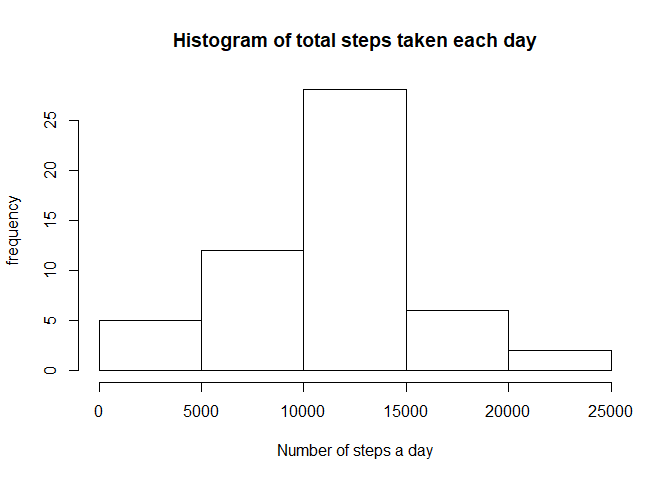
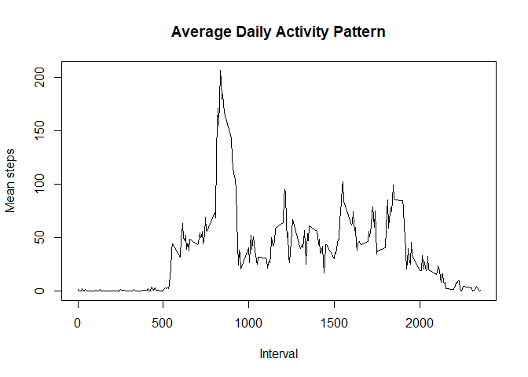
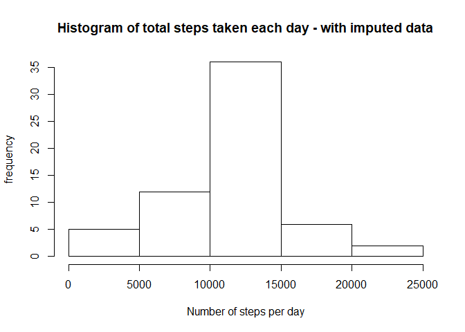
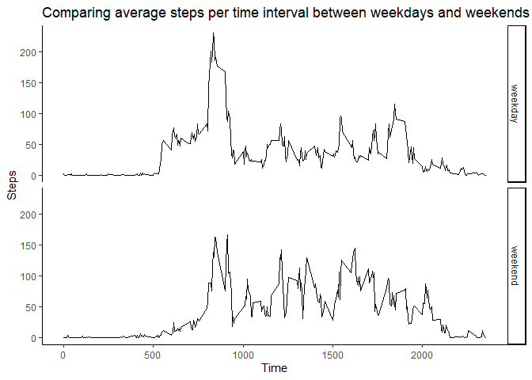
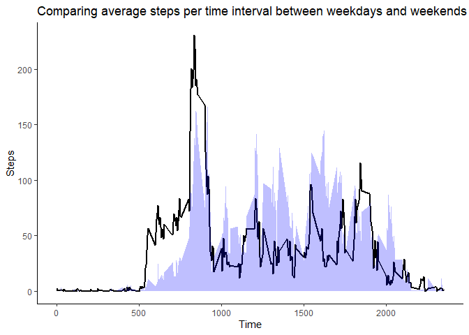

It is now possible to collect a large amount of data about personal movement using activity monitoring devices such as a Fitbit, Nike Fuelband, or Jawbone Up. These type of devices are part of the “quantified self” movement – a group of enthusiasts who take measurements about themselves regularly to improve their health, to find patterns in their behavior, or because they are tech geeks. But these data remain under-utilized both because the raw data are hard to obtain and there is a lack of statistical methods and software for processing and interpreting the data.

This report makes use of data from a personal activity monitoring device. This device collects  data at 5 minute intervals through out the day. The data consists of two months of data from an anonymous individual collected during the months of October and November, 2012 and include the number of steps taken in 5 minute intervals each day.

The data for this report is available [here](https://d396qusza40orc.cloudfront.net/repdata%2Fdata%2Factivity.zip).


## Loading and preprocessing the data


```r
knitr::opts_chunk$set(echo = TRUE)

library(tidyverse)
```

```
## Warning: package 'tidyverse' was built under R version 3.6.2
```

```
## -- Attaching packages --------------------------------------------------------------------- tidyverse 1.3.0 --
```

```
## v ggplot2 3.2.1     v purrr   0.3.3
## v tibble  2.1.3     v dplyr   0.8.4
## v tidyr   1.0.2     v stringr 1.4.0
## v readr   1.3.1     v forcats 0.4.0
```

```
## Warning: package 'tidyr' was built under R version 3.6.2
```

```
## Warning: package 'dplyr' was built under R version 3.6.2
```

```
## -- Conflicts ------------------------------------------------------------------------ tidyverse_conflicts() --
## x dplyr::filter() masks stats::filter()
## x dplyr::lag()    masks stats::lag()
```

```r
ds <- read.csv("activity.csv")

ds$date <- as.Date(ds$date)
```


## What is the mean total number of steps taken per day?
For this part of the assignment, you can ignore the missing values in the dataset.

* Calculate the total number of steps taken per day.     
* Make a histogram of the total number of steps taken each day.    
* Calculate and report the mean and median of the total number of steps taken per day.  


```r
total.steps.day = aggregate(ds$steps, by=list(ds$date), FUN = sum)
mean.steps.day = round(mean(total.steps.day$x, na.rm = TRUE),2)

median.steps = median(total.steps.day$x, na.rm = TRUE)

hist(total.steps.day$x, main = "Histogram of total steps taken each day", 
     xlab = "Number of steps a day",
     ylab = "frequency")
```

<!-- -->

The mean number of steps a day is 10766.19.  
The median number of steps is 10765.


  
  
## What is the average daily activity pattern?

Make a time series plot of the 5-minute interval (x-axis) and the average number of steps taken, averaged across all days (y-axis)
Which 5-minute interval, on average across all the days in the dataset, contains the maximum number of steps?


```r
mean.steps.interval = aggregate(data = ds, steps~interval, FUN = mean, na.action = na.omit)

max.steps <- arrange(mean.steps.interval, -steps)


plot(mean.steps.interval$interval, 
     mean.steps.interval$steps, 
     xlab = "Interval", 
     ylab = "Mean steps", 
     main = "Average Daily Activity Pattern", 
     type = "l")
```

<!-- -->

On average, the 5-minute interval with the most steps is the 835 interval.  


## Imputing missing values

Note that there are a number of days/intervals where there are missing values (coded as <span style="color:red">NA</span>. The presence of missing days may introduce bias into some calculations or summaries of the data.

Calculate and report the total number of missing values in the dataset (i.e. the total number of rows with <span style="color:red">NAs</span>.

Devise a strategy for filling in all of the missing values in the dataset. The strategy does not need to be sophisticated. For example, you could use the mean/median for that day, or the mean for that 5-minute interval, etc.

Create a new dataset that is equal to the original dataset but with the missing data filled in.


```r
num.of.missing <- sum(is.na(ds$steps))

# If a step is missing, replace it with the average for that interval,
# otherwise keep the original step number
ds <- mutate(ds, imputed.steps = ifelse(is.na(steps), 
                                             mean.steps.interval$steps[match(ds$interval,  mean.steps.interval$interval)],
                                             steps))
```

There are 2304 missing values in the dataset.  
  
The missing values have been replaced by the mean of the interval.


Make a histogram of the total number of steps taken each day and 
Calculate and report the mean and median total number of steps taken per day. 
Do these values differ from the estimates from the first part of the assignment? 
What is the impact of imputing missing data on the estimates of the total daily number of steps?


```r
total.steps.day.imputed = aggregate(ds$imputed.steps, by=list(ds$date), FUN = sum)
mean.steps.day.imputed = round(mean(total.steps.day.imputed$x, na.rm = FALSE),2)
median.steps.imputed = median(total.steps.day.imputed$x, na.rm = FALSE)

hist(total.steps.day.imputed$x, main = "Histogram of total steps taken each day - with imputed data", 
     xlab = "Number of steps per day",
     ylab = "frequency")
```

<!-- -->

The mean of the imputed steps is 10766.19 and the median of the imputed steps is 10766.19.
The imputed steps differ from the original data set by 0 for the mean and -1.1886792 for the median.  

The median has changed slightly, this is evident in the changed distribution between the two histograms.


  
## Are there differences in activity patterns between weekdays and weekends?

For this part the \color{red}{\verb|weekdays()|}weekdays() function may be of some help here. Use the dataset with the filled-in missing values for this part.

Create a new factor variable in the dataset with two levels – “weekday” and “weekend” indicating whether a given date is a weekday or weekend day.

Make a panel plot containing a time series plot (i.e. \color{red}{\verb|type = "l"|}type="l") of the 5-minute interval (x-axis) and the average number of steps taken, averaged across all weekday days or weekend days (y-axis). See the README file in the GitHub repository to see an example of what this plot should look like using simulated data.


```r
ds <- mutate(ds, weekday.type = ifelse(weekdays(ds$date)=="Saturday", 
                                       "weekend", 
                                       ifelse(weekdays(ds$date)=="Sunday", 
                                       "weekend",
                                       "weekday")))

ds$weekday.type <- as.factor(ds$weekday.type)


mean.steps.daytype = aggregate(ds$imputed.steps, by=list(ds$interval, 
                                                         ds$weekday.type), 
                               FUN = mean, 
                               na.action= na.omit)

mean.steps.daytype$Group.2 <- as.factor(mean.steps.daytype$Group.2)
```


```r
ggplot(mean.steps.daytype, aes(x=Group.1, y=x)) +
    geom_line() + 
    facet_grid(Group.2 ~ .) +
    ggtitle("Comparing average steps per time interval between weekdays and weekends") +
    xlab("Time") + ylab("Steps") +
    theme_classic()
```

<!-- -->

The main differences in activity appears to be before 9am and around 5pm. At both points there is more active on a weekday, most likely as that is when people are on the way to and from work. People are also generally more active in the afternoon on weekends then during the week.   
An alternative presentation comparing the activity is presented below.


```r
ds.chart <- spread(mean.steps.daytype, key=Group.2, value = x)

ggplot(ds.chart) +
    geom_line(aes(x=Group.1, y=weekday), colour = "black", size = 0.75) +
    geom_area(aes(x=Group.1, y=weekend), fill = "blue", alpha = 0.25) +
    ggtitle("Comparing average steps per time interval between weekdays and weekends") +
    xlab("Time") + ylab("Steps") +
    theme_classic()
```

<!-- -->

